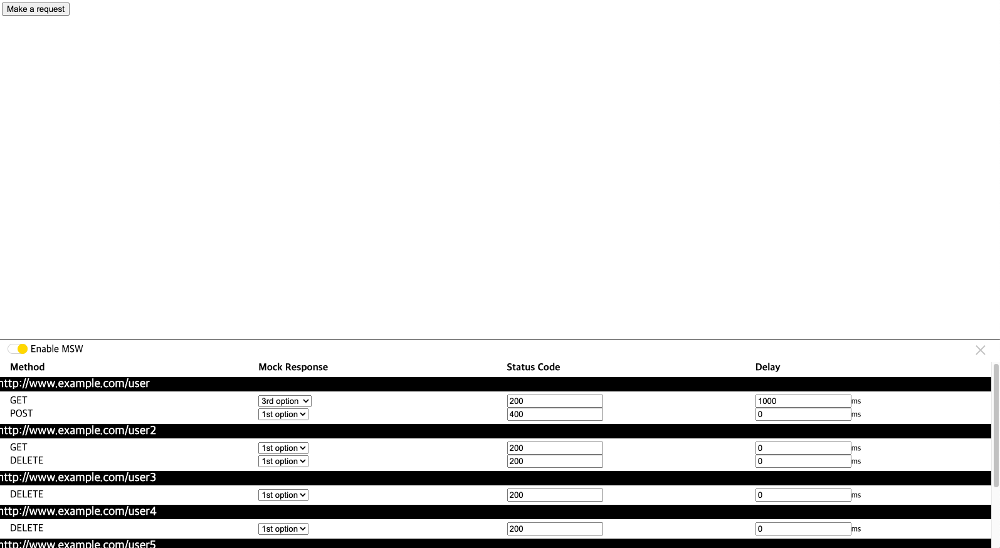

# MSW Dev Toolbar

A simple GUI to make your MSW experience a little bit better.


## Install

`npm install @korkt-kim/msw-dev-tool`

`yarn add @korkt-kim/msw-dev-tool`

`pnpm add @korkt-kim/msw-dev-tool`

## Usage

```js
import { worker } from './mocks/browser.js';

worker.start();

new MSWToolbar({
  worker,
  isEnabled: true,
});
```

## Props

| Name      | Type    | Default | Description                      |
| --------- | ------- | ------- | -------------------------------- |
| isEnabled | boolean | true    | whether to enable "msw dev tool" |
